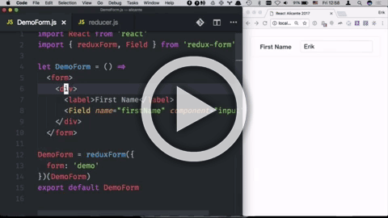
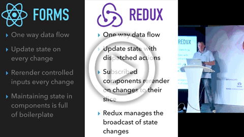

# redux-form

---

`redux-form` works with [React Redux](https://github.com/reactjs/react-redux) to
enable an html form in [React](https://github.com/facebook/react) to use
[Redux](https://github.com/reactjs/redux) to store all of its state.

## ⚠️ ATTENTION ⚠️

If you're just getting started with your application and are looking for a form solution, the [general consensus of the community](https://twitter.com/acemarke/status/1124771065115185152) is that you should _not_ put your form state in Redux. The author of Redux Form took all of the lessons he learned about form use cases from maintaining Redux Form and built [🏁 React Final Form](https://github.com/final-form/react-final-form#-react-final-form), which he recommends you use if you are just starting your project. It's also pretty easy to migrate to from Redux Form, because the `<Field>` component APIs are so similar. [Here is a blog post](https://codeburst.io/final-form-the-road-to-the-checkered-flag-cd9b75c25fe) where he explains his reasoning, or [there are two talks](https://github.com/final-form/react-final-form#videos) if you prefer video. [Formik](https://jaredpalmer.com/formik/) is also a nice solution.

The only good reason, [in the author's view](https://twitter.com/erikras/status/1035082880341483520), to use Redux Form in your application is if you need _really_ tight coupling of your form data with Redux, specifically if you need to subscribe to it and modify it from parts of your application far from your form component, e.g. on another route. If you don't have that requirement, use [🏁 React Final Form](https://github.com/final-form/react-final-form#-react-final-form).

## Installation

`npm install --save redux-form`

## Documentation

- [Getting Started](https://redux-form.com/8.2.2/docs/GettingStarted.md/)
- [Examples](https://redux-form.com/8.2.2/examples/)
- [API](https://redux-form.com/8.2.2/docs/api/)
- [FAQ](https://redux-form.com/8.2.2/docs/faq/)
- [Release Notes](https://github.com/erikras/redux-form/releases)
- [Older Documentation](https://redux-form.com/8.2.2/docs/DocumentationVersions.md/)

## 🏖 Code Sandboxes 🏖

You can play around with `redux-form` in these sandbox versions of the Examples.

- [Simple Form](https://codesandbox.io/s/mZRjw05yp)
- [Synchronous Validation](https://codesandbox.io/s/pQj03w7Y6)
- [Field-Level Validation](https://codesandbox.io/s/PNQYw1kVy)
- [Submit Validation](https://codesandbox.io/s/XoA5vXDgA)
- [Asynchronous Blur Validation](https://codesandbox.io/s/nKlYo387)
- [Initializing From State](https://codesandbox.io/s/MQnD536Km)
- [Field Arrays](https://codesandbox.io/s/Ww4QG1Wx)
- [Remote Submit](https://codesandbox.io/s/ElYvJR21K)
- [Normalizing](https://codesandbox.io/s/L8KWERjDw)
- [Immutable JS](https://codesandbox.io/s/ZVGJQBJMw)
- [Selecting Form Values](https://codesandbox.io/s/gJOBWZMRZ)
- [Wizard Form](https://codesandbox.io/s/0Qzz3843)

## Videos

|  |
| :------------------------------------------------------------------------------------------------------------------: |
|                              **A Practical Guide to Redux Form – React Alicante 2017**                               |

|  |
| :-----------------------------------------------------------------------------------------------------------------: |
|                            **Abstracting Form State with Redux Form – JS Channel 2016**                             |

## Contributors

This project exists thanks to all the people who contribute.

## Backers

Thank you to all our backers! 🙏 [[Become a backer](https://opencollective.com/redux-form#backer)]

## Sponsors

Support this project by becoming a sponsor. Your logo will show up here with a link to your website. [[Become a sponsor](https://opencollective.com/redux-form#sponsor)]

